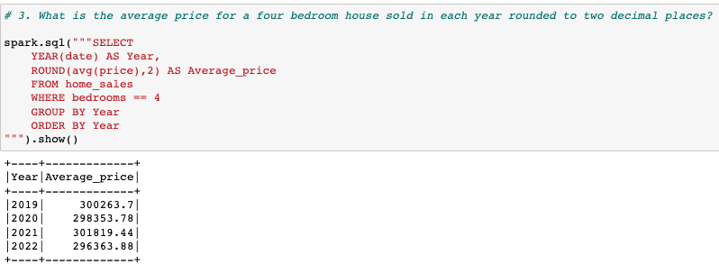
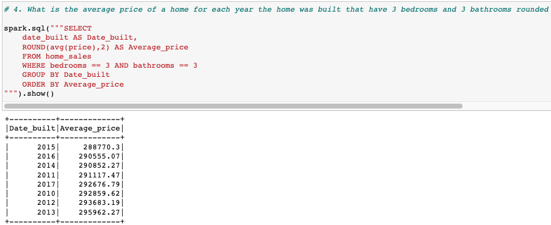
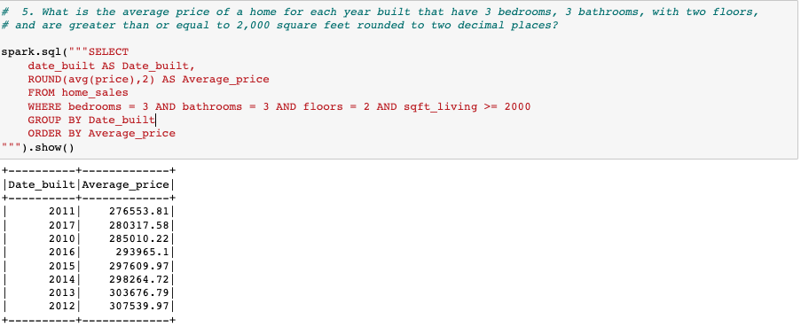
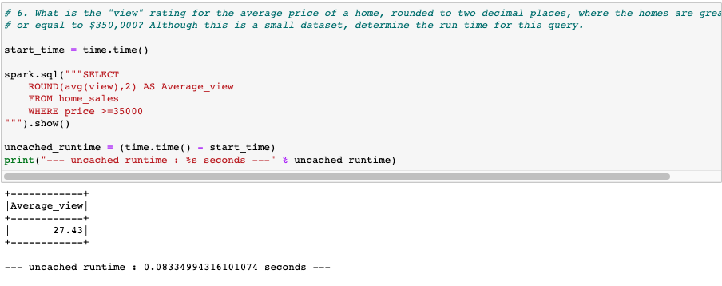
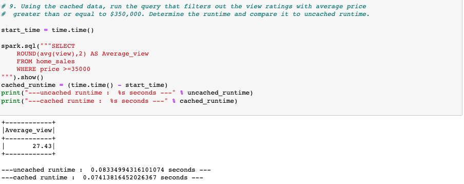
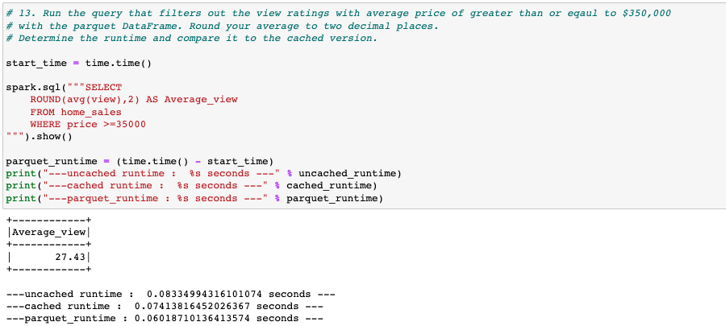

# BigData : Home Sales

  

 

In this report, I utilized SparkSQL to analyze and derive key metrics from home sales data. I performed various tasks such as creating temporary views, partitioning the data, caching and uncaching a temporary table, and verifying the uncaching process. By leveraging the capabilities of Spark, I aimed to gain valuable insights into the home sales dataset and provide meaningful findings. Through this report, I will demonstrate how SparkSQL enables efficient and powerful data processing for complex analytical tasks.

## Table of Contents: 

1. [Overview of the Analysis](#overview-of-the-analysis)

2. [Model Results](#results)

3. [Summary](#summary)

 

## **Overview of the Analysis**

- In this project, the goal is to analyze the home sales data using PySpark SQL functions. 
- The provided dataset, home_sales_revised.csv, is read into a Spark DataFrame and a temporary table called "home_sales" is created. 
- Various questions are answered using SparkSQL, including calculating average prices based on different criteria. 
- The runtime of specific queries is determined, and caching is implemented to improve performance. 
- Additionally, partitioning and formatting the data using parquet files is demonstrated. 
- The final steps involve uncaching the temporary table and verifying its status, followed by uploading the completed Home_Sales.ipynb file to a GitHub repository.

 

## **Results**

 

  

 

  

 

  

 

  

 

  

 

  

 

 

## **Summary**

`In this analysis, the efficiency of different methods in processing a large dataset was evaluated based on their runtime. The uncached method, which did not utilize caching or partitioning, took 0.0833 seconds to complete the task. On the other hand, the cached method, incorporating caching, significantly improved performance and reduced the runtime to 0.07413 seconds. The most efficient method was the parquet partitioned approach, which combined caching and partitioning techniques, resulting in a runtime of 0.0602 seconds. These results demonstrate that leveraging caching and partitioning can lead to substantial improvements in processing time for data analysis tasks involving large datasets.`